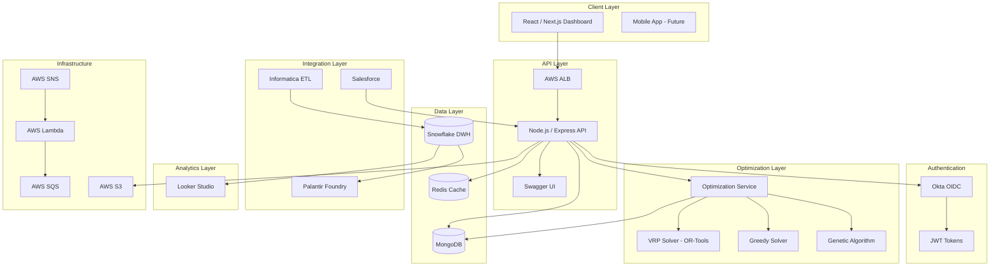
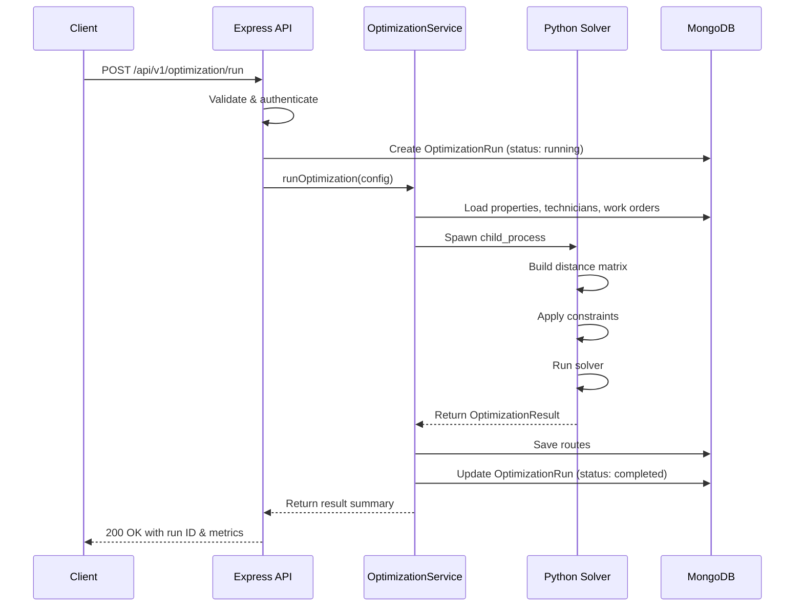

# System Architecture

## Overview

The Route Optimization Engine is a distributed system designed to generate optimal daily routes for field technicians. The architecture follows a modular design where each component can be developed, deployed, and scaled independently.

## System Architecture Diagram



## Component Design

### 1. Optimization Engine (Python)

The core of the system, responsible for computing optimal routes.

```
optimization/
├── solvers/
│   ├── base_solver.py      # Abstract interface + data models
│   ├── vrp_solver.py       # Google OR-Tools VRPTW
│   ├── greedy_solver.py    # Nearest-neighbor heuristic
│   └── genetic_solver.py   # Evolutionary algorithm
└── utils/
    ├── distance.py          # Haversine + matrix builders
    └── constraints.py       # Validation functions
```

**Design Decisions:**

- **Strategy Pattern**: All solvers implement `BaseSolver.solve()`, making them interchangeable
- **Dataclasses**: `RouteStop`, `TechnicianRoute`, `OptimizationResult` provide type-safe data transfer
- **Separation of Concerns**: Distance calculation and constraint validation extracted into utilities
- **Graceful Degradation**: VRP solver skips if `ortools` is not installed; other solvers are pure Python

**Data Flow:**

```
Input:                              Output:
┌─────────────┐                     ┌─────────────────────┐
│ Properties  │                     │ OptimizationResult   │
│ Technicians │ ──> Solver ──────>  │  ├── routes[]        │
│ Work Orders │                     │  │   ├── stops[]     │
│ Config      │                     │  │   └── summary     │
└─────────────┘                     │  ├── unassigned[]    │
                                    │  └── metrics         │
                                    └─────────────────────┘
```

### 2. Backend API (Node.js / Express)

RESTful API providing CRUD operations and optimization orchestration.

**Request Flow:**

```
Client Request
    │
    ├── CORS / Helmet / Compression
    ├── Rate Limiter (100 req/15min)
    ├── JWT Authentication
    ├── Role Authorization
    ├── Input Validation (express-validator)
    │
    ├── Route Handler
    │   ├── Mongoose Query / Aggregation
    │   └── Response
    │
    └── Error Handler (centralized)
```

**Key Patterns:**

- **Middleware Chain**: Security headers -> auth -> validation -> handler -> error handler
- **Service Layer**: `OptimizationService` decouples route handlers from Python subprocess calls
- **Mongoose Statics**: Domain logic on models (e.g., `Property.findNearby()`, `Technician.findAvailableWithSkills()`)
- **GeoJSON Indexes**: 2dsphere indexes for spatial queries (`$near`, `$geoWithin`)

### 3. Frontend Dashboard (React / Next.js 14)

Interactive dashboard for route visualization and analytics.

**Component Hierarchy:**

```
AppLayout
├── Sidebar (navigation)
├── Header (date, notifications)
└── Page Content
    ├── FilterPanel
    ├── MetricsCards (6 KPIs)
    ├── RouteMap (Leaflet)
    │   ├── TileLayer (OpenStreetMap)
    │   ├── Polylines (color per technician)
    │   ├── CircleMarkers (numbered stops)
    │   └── Markers (home bases)
    ├── UtilizationChart (Recharts Bar)
    ├── AlgorithmComparison (table)
    ├── DailyTrends (Recharts Line)
    └── Route Details (table)
```

**Key Patterns:**

- **App Router**: Next.js 14 app directory structure
- **SSR Safety**: Map components loaded with `next/dynamic` and `ssr: false` (Leaflet requires DOM)
- **Custom Hook**: `useDashboardData` centralizes data fetching with loading/error states
- **Mock Data Fallback**: Dashboard renders with realistic sample data when API is unavailable

### 4. Data Warehouse (Snowflake)

Medallion architecture for analytics workloads.

```
┌──────────────────────────────────────────────────────┐
│                    SNOWFLAKE                          │
│                                                      │
│  ┌─────────┐    ┌───────────┐    ┌───────────────┐  │
│  │   RAW   │───>│  STAGING  │───>│   ANALYTICS   │  │
│  │         │    │           │    │               │  │
│  │ Source  │    │ Cleansed  │    │ Star Schema   │  │
│  │ tables  │    │ + deduped │    │ Dims + Facts  │  │
│  │ VARIANT │    │ + typed   │    │ SCD Type 2    │  │
│  └─────────┘    └───────────┘    └───────────────┘  │
│                                                      │
│  Streams ──> Tasks ──> Merge Procedures              │
│                                                      │
│  Views: route_performance, technician_workload,      │
│         optimization_comparison                      │
└──────────────────────────────────────────────────────┘
```

**Key Features:**

- **CDC with Streams**: Snowflake streams detect changes in staging tables
- **SCD Type 2**: Technician dimension tracks historical changes
- **Star Schema**: Date, Property, Technician dimensions; Route, Route Stop, Work Order facts
- **Dedicated Warehouses**: INGEST_WH (XS), COMPUTE_WH (S), ANALYTICS_WH (M) with auto-suspend

## Data Flow

### End-to-End Pipeline

```
1. Source Systems          2. Ingestion              3. Storage
┌──────────────┐          ┌──────────────┐          ┌──────────────┐
│ Salesforce   │──sync───>│ Python Sync  │───────>  │   MongoDB    │
│ Manual Entry │──API────>│ Express API  │───────>  │ (Operational)│
│ IoT Sensors  │──stream─>│ Informatica  │───────>  │  Snowflake   │
└──────────────┘          └──────────────┘          │ (Analytical) │
                                                     └──────┬───────┘
                                                            │
4. Processing             5. Optimization            6. Delivery
┌──────────────┐          ┌──────────────┐          ┌──────────────┐
│ Foundry      │<─────────│ VRP / Greedy │<─────────│ Dashboard    │
│ Ontology     │          │ / Genetic    │───────>  │ Looker       │
│ Transforms   │          │ Algorithms   │          │ Mobile       │
└──────────────┘          └──────────────┘          │ Notifications│
                                                     └──────────────┘
```

### Optimization Request Flow



## Security Architecture

```
┌─────────────────────────────────────────────┐
│              Security Layers                 │
│                                              │
│  ┌─────────────────────────────────────┐    │
│  │ Network: VPC, Security Groups, ALB  │    │
│  │  ┌──────────────────────────────┐   │    │
│  │  │ Transport: HTTPS / TLS 1.2+  │   │    │
│  │  │  ┌───────────────────────┐   │   │    │
│  │  │  │ Auth: Okta OIDC / JWT │   │   │    │
│  │  │  │  ┌────────────────┐   │   │   │    │
│  │  │  │  │ RBAC: 6 Roles  │   │   │   │    │
│  │  │  │  │ Zone-Based ACL │   │   │   │    │
│  │  │  │  └────────────────┘   │   │   │    │
│  │  │  └───────────────────────┘   │   │    │
│  │  └──────────────────────────────┘   │    │
│  └─────────────────────────────────────┘    │
│                                              │
│  Middleware: Helmet, CORS, Rate Limiting     │
│  Data: Field-level encryption, audit logs    │
└─────────────────────────────────────────────┘
```

**Roles:**

| Role | Access Level |
|------|-------------|
| `admin` | Full system access |
| `operations_manager` | Route management, all technicians |
| `dispatcher` | Route viewing, assignment |
| `field_supervisor` | Zone-scoped technician management |
| `technician` | Own routes and work orders |
| `analyst` | Read-only analytics |

## Deployment Architecture

### AWS Infrastructure

```
┌─────────────────────────────────────────────────┐
│                    AWS VPC                       │
│                                                  │
│  ┌──────────── Public Subnets ──────────────┐   │
│  │  ALB ──> Target Group                     │   │
│  └───────────────┬──────────────────────────┘   │
│                  │                               │
│  ┌──────────── Private Subnets ─────────────┐   │
│  │                                           │   │
│  │  ┌─────────┐  ┌─────────┐  ┌─────────┐  │   │
│  │  │ ECS     │  │ ECS     │  │ Lambda  │  │   │
│  │  │ API     │  │ Optim.  │  │ Trigger │  │   │
│  │  │ Fargate │  │ Fargate │  │         │  │   │
│  │  └────┬────┘  └────┬────┘  └────┬────┘  │   │
│  │       │            │            │         │   │
│  │  ┌────┴────────────┴────────────┴────┐   │   │
│  │  │         SQS Queue + DLQ           │   │   │
│  │  └───────────────────────────────────┘   │   │
│  └───────────────────────────────────────────┘   │
│                                                  │
│  S3 (Data)    SNS (Notifications)                │
└─────────────────────────────────────────────────┘
```

### Container Strategy

- **API Container**: Node.js 18 Alpine, 3-stage build (deps -> build -> runtime), non-root user, tini init
- **Optimization Container**: Python 3.11 slim, geospatial libraries (GDAL, GEOS), uvicorn server
- **Resource Limits**: API (256MB / 0.5 vCPU), Optimization (1GB / 1.0 vCPU)

## Scalability Considerations

| Concern | Approach |
|---------|----------|
| **API Load** | ALB + ECS auto-scaling, Redis caching |
| **Large Optimization** | SQS decoupling, async processing, timeout limits |
| **Data Volume** | Snowflake elastic scaling, MongoDB sharding ready |
| **Concurrent Users** | Rate limiting (100 req/15min), CDN for static assets |
| **Geographic Expansion** | Zone-based partitioning, regional deployments |

## Monitoring and Observability

- **Application**: New Relic APM for Node.js and Python
- **Logs**: Winston (structured JSON) -> CloudWatch Logs
- **Metrics**: Custom CloudWatch metrics for optimization runtime, route quality
- **Health Checks**: `/health` (liveness), `/health/ready` (readiness with DB check)
- **Alerts**: SNS notifications for failed optimizations, SLA breaches
