# Architecture Diagrams - Route Optimization Engine

This document provides visual representations of the Route Optimization Engine's ontology structure, data flows, and system architecture using Mermaid diagram syntax.

## Table of Contents

1. [Entity Relationship Diagram](#entity-relationship-diagram)
2. [Ontology Object Hierarchy](#ontology-object-hierarchy)
3. [Data Flow Architecture](#data-flow-architecture)
4. [ETL Pipeline Flow](#etl-pipeline-flow)
5. [Route Optimization Workflow](#route-optimization-workflow)
6. [Real-Time Update Flow](#real-time-update-flow)
7. [System Integration Architecture](#system-integration-architecture)
8. [Snowflake Layer Architecture](#snowflake-layer-architecture)

---

## Entity Relationship Diagram

Complete entity relationship diagram showing all Ontology Object Types and their Link Types.

```mermaid
erDiagram
    PROPERTY ||--o{ WORK_ORDER : "has"
    WORK_ORDER }o--|| PROPERTY : "at"
    
    TECHNICIAN ||--o{ ROUTE : "assigned"
    ROUTE }o--|| TECHNICIAN : "assigned to"
    
    ROUTE ||--o{ ROUTE_STOP : "contains"
    ROUTE_STOP }o--|| ROUTE : "belongs to"
    
    WORK_ORDER ||--o{ ROUTE_STOP : "scheduled as"
    ROUTE_STOP }o--|| WORK_ORDER : "services"
    
    PROPERTY {
        string propertyId PK
        string address
        string city
        string state
        string zipCode
        double latitude
        double longitude
        string propertyType
        string zoneId
        integer squareFootage
        string accessNotes
        timestamp createdAt
        timestamp updatedAt
    }
    
    WORK_ORDER {
        string workOrderId PK
        string propertyId FK
        string title
        string description
        string category
        string priority
        stringset requiredSkills
        integer estimatedDurationMinutes
        timestamp timeWindowStart
        timestamp timeWindowEnd
        string status
        string sourceSystem
        double estimatedCost
        double actualCost
        timestamp createdAt
        timestamp updatedAt
        timestamp completedAt
    }
    
    TECHNICIAN {
        string technicianId PK
        string name
        string email
        string phone
        double homeLatitude
        double homeLongitude
        stringset skills
        double maxDailyHours
        double maxDailyDistanceMiles
        double hourlyRate
        string availabilityStatus
        stringset zonePreference
        string employeeType
        stringset certifications
        timestamp createdAt
        timestamp updatedAt
    }
    
    ROUTE {
        string routeId PK
        string optimizationRunId
        string technicianId FK
        date routeDate
        double totalDistanceMiles
        double totalDurationMinutes
        integer numStops
        string algorithmUsed
        string algorithmVersion
        string status
        double totalWorkMinutes
        double totalTravelMinutes
        timestamp startTime
        timestamp endTime
        double optimizationScore
        timestamp createdAt
        timestamp updatedAt
    }
    
    ROUTE_STOP {
        string stopId PK
        string routeId FK
        string workOrderId FK
        integer sequenceNumber
        timestamp arrivalTime
        timestamp departureTime
        double travelDistanceMiles
        double travelDurationMinutes
        timestamp actualArrivalTime
        timestamp actualDepartureTime
        string stopStatus
        double waitTimeMinutes
        timestamp createdAt
        timestamp updatedAt
    }
```

---

## Ontology Object Hierarchy

Hierarchical view of how objects relate in the Ontology, showing the primary navigation paths.

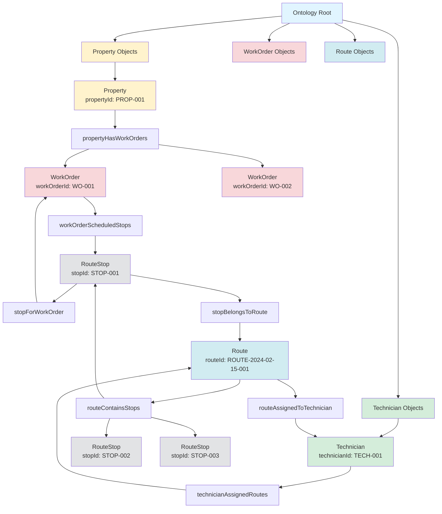

---

## Data Flow Architecture

End-to-end data flow from source systems through to consumption layers.

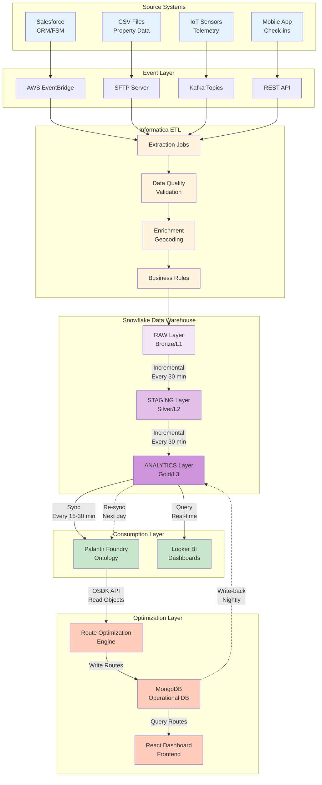

---

## ETL Pipeline Flow

Detailed view of the Informatica ETL pipeline stages.

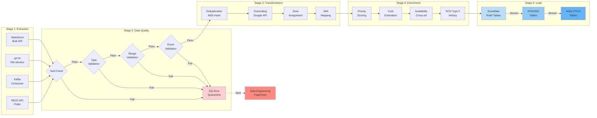

---

## Route Optimization Workflow

Sequence diagram showing the route optimization process from trigger to dashboard update.

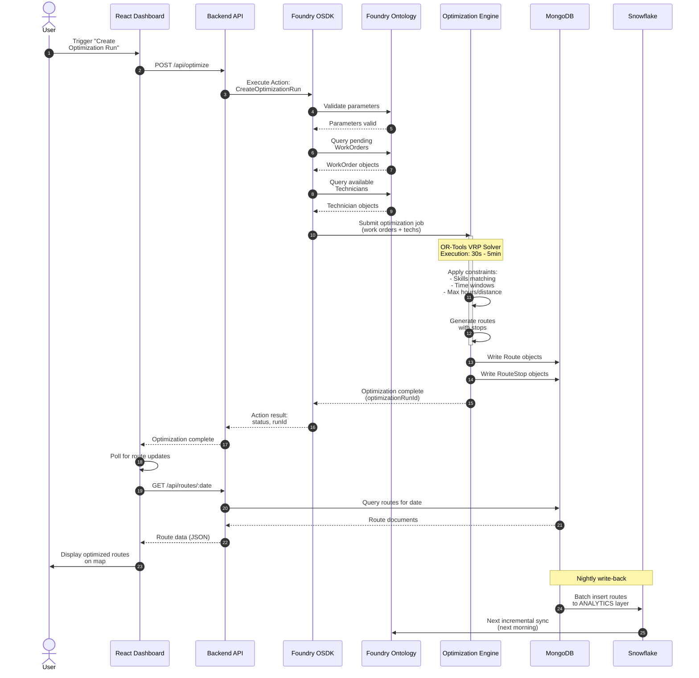

---

## Real-Time Update Flow

Change Data Capture (CDC) flow showing how work order updates propagate through the system.

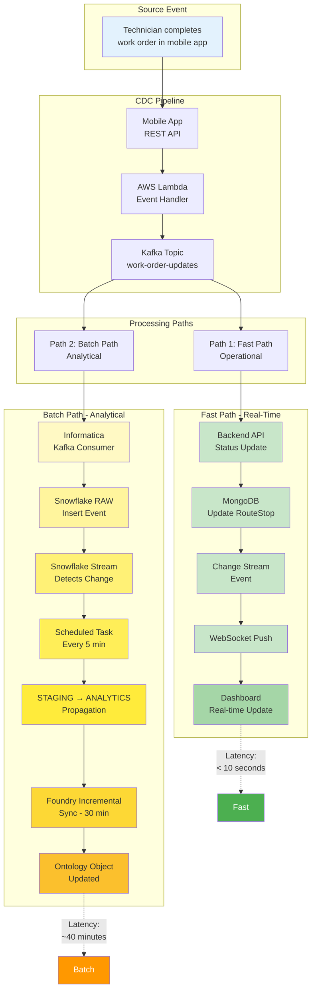

---

## System Integration Architecture

High-level system architecture showing all major components and their interactions.

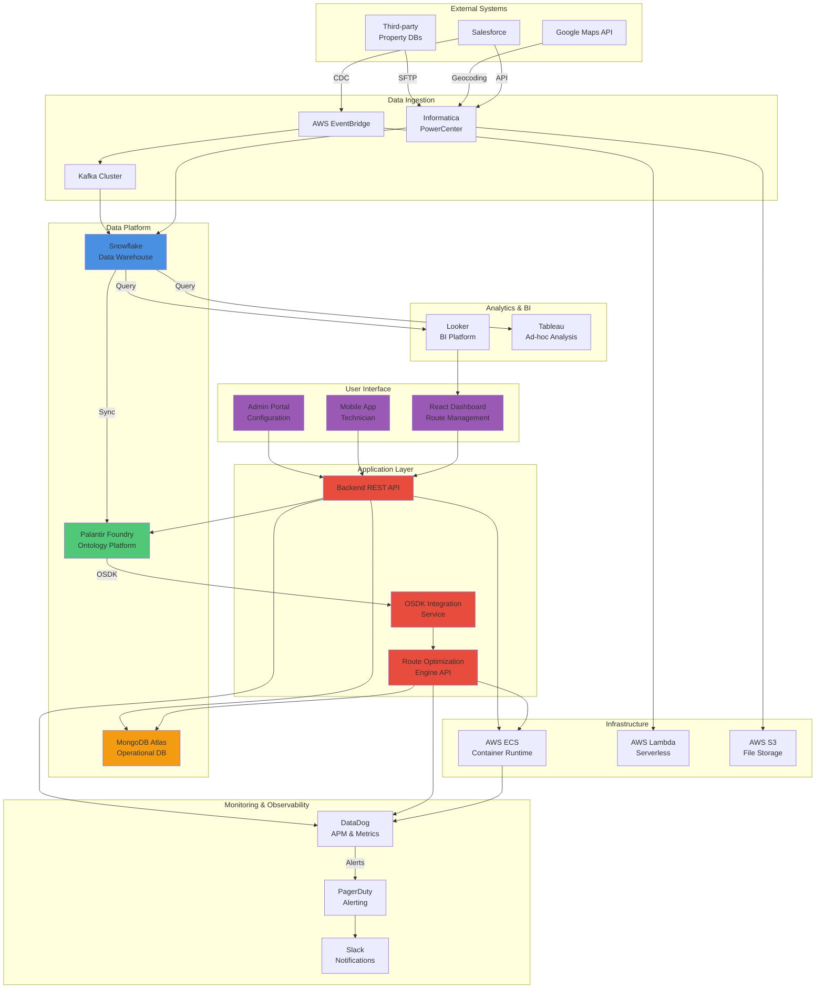

---

## Snowflake Layer Architecture

Detailed view of the Snowflake data warehouse layers and transformations.

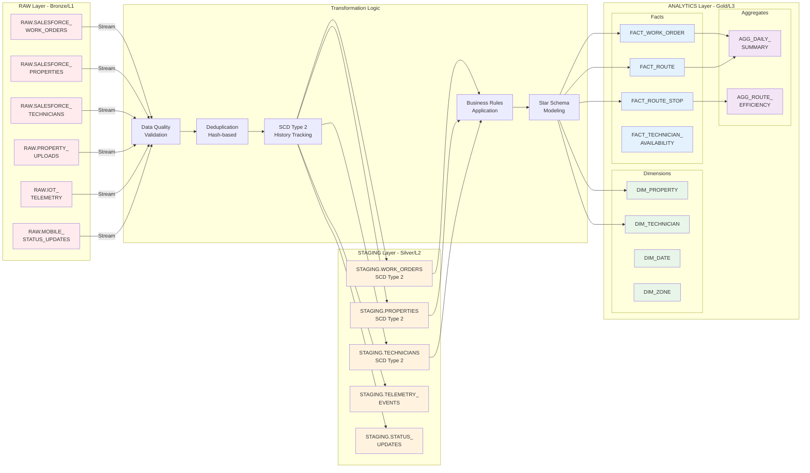

---

## Ontology Action Flow

Detailed flow of executing an Ontology Action through OSDK.

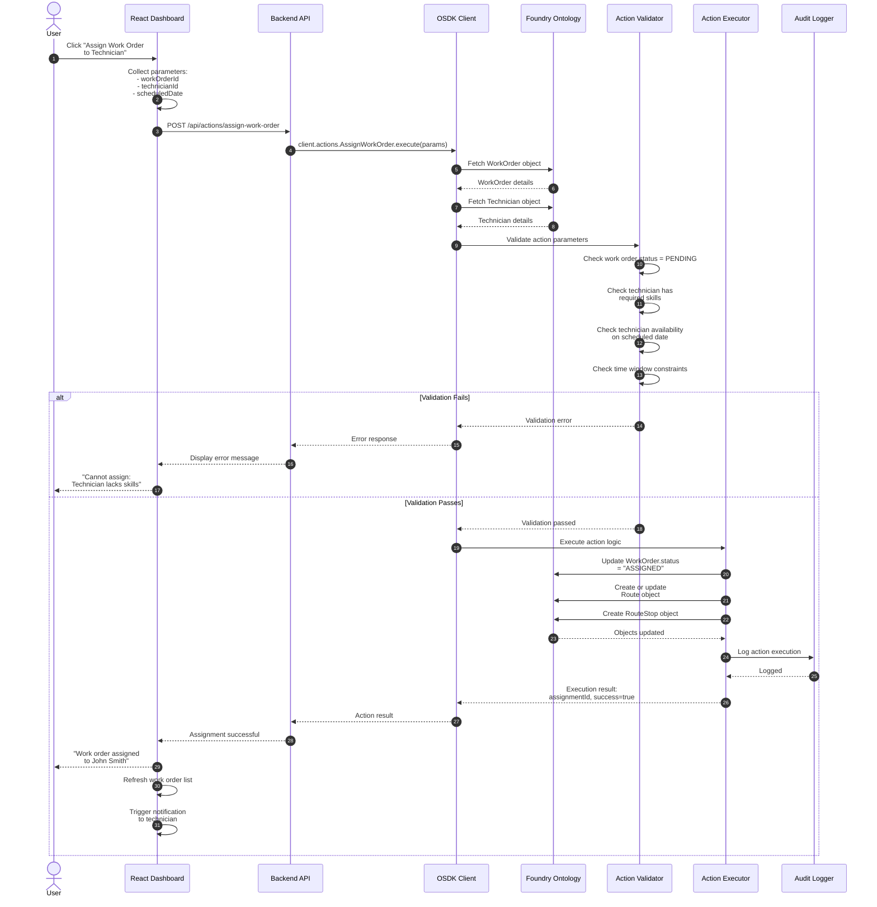

---

## Foundry to MongoDB Sync Flow

Visualization of how optimization results flow from Foundry Ontology to MongoDB and back.

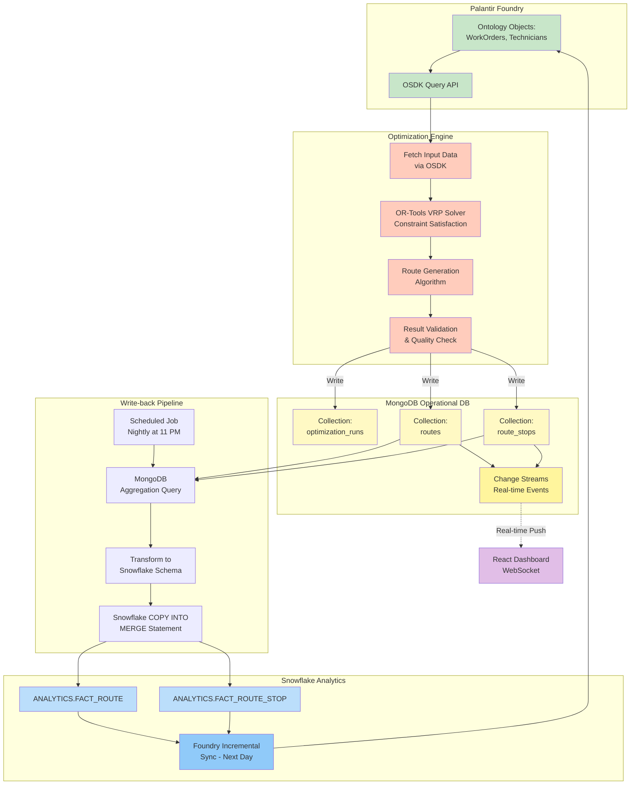

---

## Network Architecture

Deployment and network architecture showing security zones and data flows.

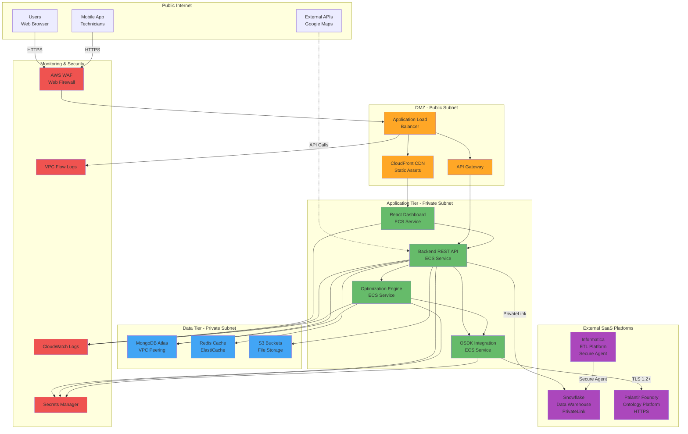

---

## Optimization Algorithm Flow

Internal flow of the route optimization algorithm.

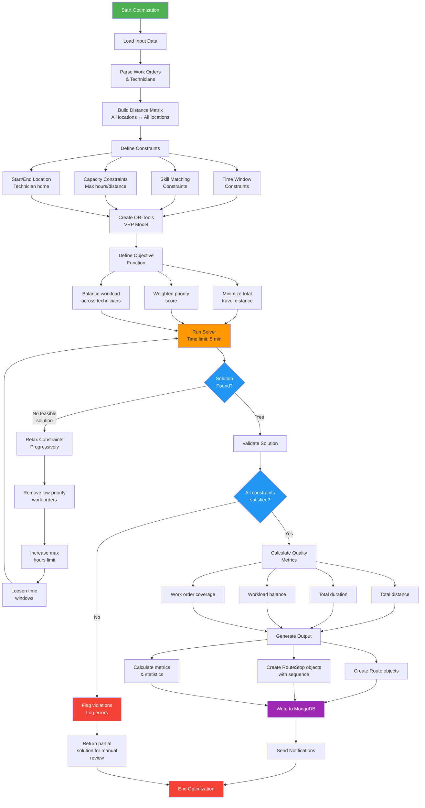

---

## Data Lineage Diagram

Tracking data lineage from source to consumption.

```mermaid
graph LR
    subgraph "Source"
        S1[Salesforce<br/>Work Order Created<br/>2024-02-12 10:00 AM]
    end
    
    subgraph "Ingestion - L1"
        I1[EventBridge Event<br/>event-12345<br/>2024-02-12 10:01 AM]
        I2[Lambda Function<br/>ETL-handler<br/>2024-02-12 10:01 AM]
        I3[RAW.SALESFORCE_<br/>WORK_ORDERS<br/>RAW_ID: abc-123<br/>2024-02-12 10:03 AM]
    end
    
    subgraph "Transformation - L2"
        T1[Snowflake Stream<br/>Detected Change<br/>2024-02-12 10:05 AM]
        T2[Scheduled Task<br/>PROCESS_WORK_ORDERS<br/>2024-02-12 10:05 AM]
        T3[STAGING.WORK_ORDERS<br/>WORK_ORDER_SK: 456<br/>2024-02-12 10:08 AM]
    end
    
    subgraph "Analytics - L3"
        A1[ETL Logic<br/>Star Schema Mapping<br/>2024-02-12 10:10 AM]
        A2[ANALYTICS.FACT_<br/>WORK_ORDER<br/>WORK_ORDER_ID: WO-789<br/>2024-02-12 10:12 AM]
    end
    
    subgraph "Consumption"
        C1[Foundry Sync<br/>Incremental Pull<br/>2024-02-12 10:30 AM]
        C2[Ontology Object<br/>WorkOrder: WO-789<br/>2024-02-12 10:32 AM]
        C3[OSDK Query<br/>Optimization Engine<br/>2024-02-12 08:00 PM]
        C4[Route Generated<br/>ROUTE-2024-02-13-001<br/>2024-02-12 08:02 PM]
    end
    
    S1 -->|CDC Event| I1
    I1 --> I2
    I2 -->|ETL_BATCH_ID:<br/>batch-2024-02-12-1001| I3
    
    I3 -->|Stream| T1
    T1 --> T2
    T2 -->|Transform<br/>+ SCD Type 2| T3
    
    T3 -->|Business Rules<br/>+ Joins| A1
    A1 --> A2
    
    A2 -->|Dataset Sync| C1
    C1 --> C2
    C2 -->|OSDK API| C3
    C3 -->|Optimization<br/>Algorithm| C4
    
    style S1 fill:#e3f2fd
    style I3 fill:#ffebee
    style T3 fill:#fff3e0
    style A2 fill:#e8f5e9
    style C2 fill:#f3e5f5
    style C4 fill:#fff9c4
    
    A2 -.->|Audit Trail<br/>Query Lineage| AUDIT[Data Lineage<br/>Report]
    style AUDIT fill:#ffccbc
```

---

## Error Handling and Retry Flow

Comprehensive error handling across the system.

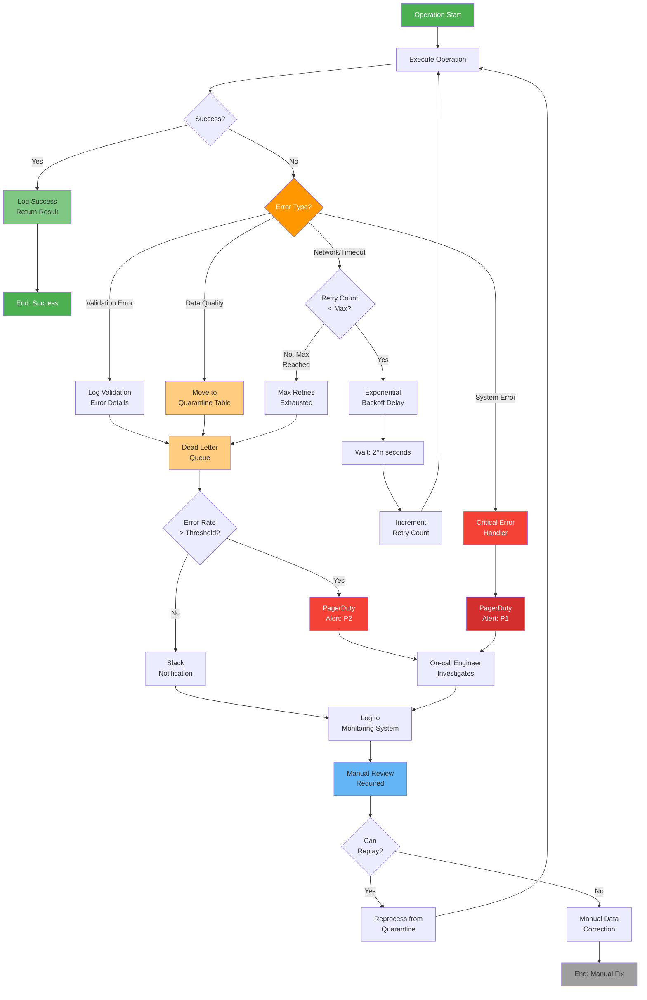

---

## Appendix: Diagram Legend

### Node Colors and Meanings

- **Blue tones**: Data storage and persistence layers
- **Green tones**: Palantir Foundry and Ontology components
- **Orange tones**: ETL and transformation processes
- **Red tones**: Optimization and algorithmic components
- **Purple tones**: User interface and frontend
- **Yellow tones**: MongoDB and operational databases
- **Gray tones**: Infrastructure and monitoring

### Relationship Types

- **Solid lines**: Direct data flow or API calls
- **Dashed lines**: Async/scheduled processes or write-backs
- **Arrows**: Direction of data flow
- **Double arrows**: Bidirectional sync or communication

### Diagram Tools

All diagrams in this document use Mermaid syntax and can be:
- Rendered in GitHub, GitLab, Bitbucket
- Embedded in Confluence or Notion
- Exported to PNG/SVG using Mermaid CLI
- Edited using Mermaid Live Editor (https://mermaid.live)

---

## Revision History

| Version | Date | Author | Changes |
|---------|------|--------|---------|
| 1.0 | 2024-02-12 | Data Architecture Team | Initial creation of all diagrams |

---

## Related Documentation

- [Ontology Model Documentation](./ontology_model.md)
- [Data Flow Documentation](./data_flow.md)
- Backend API Technical Design
- Frontend Architecture Guide
- Optimization Algorithm Specification
